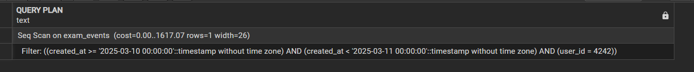
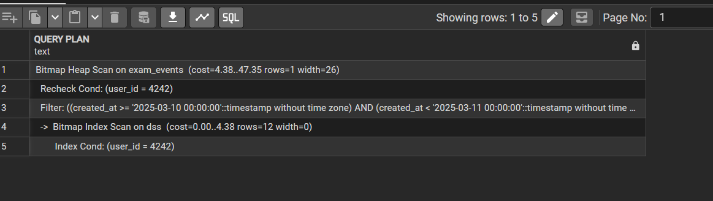
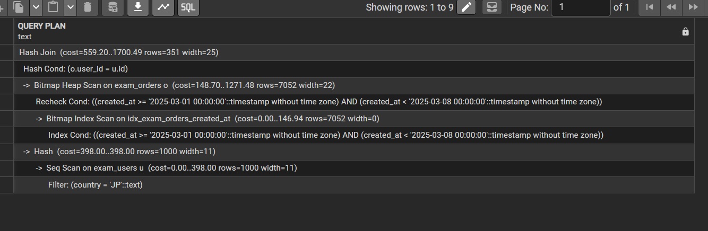
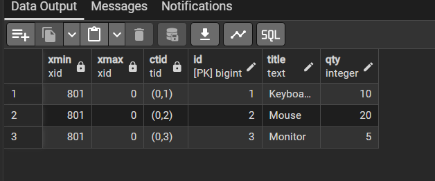
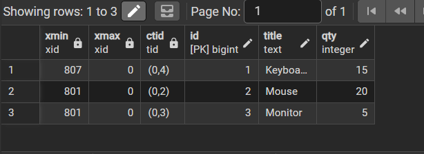
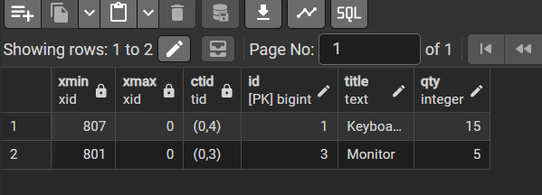
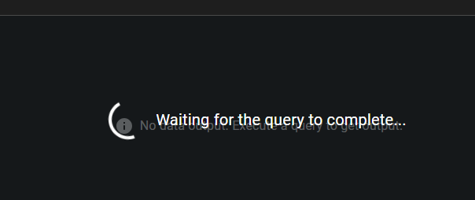
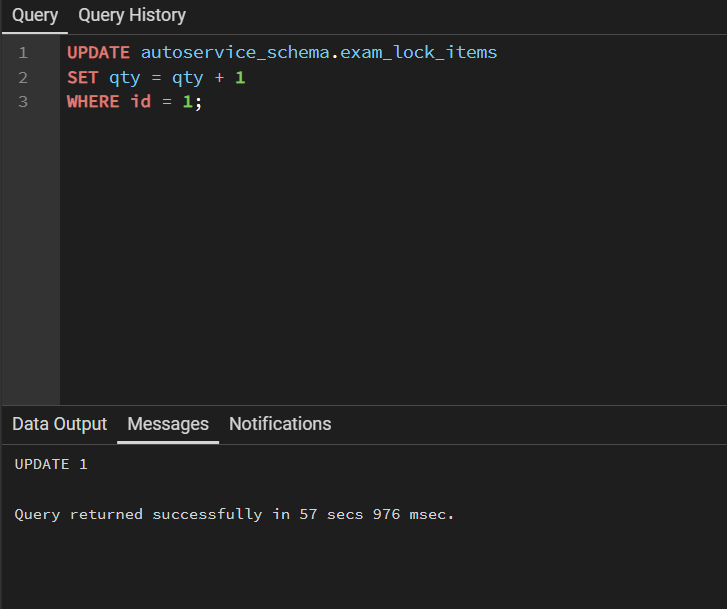
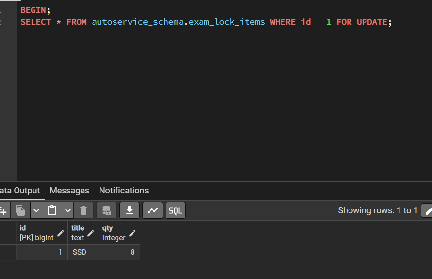
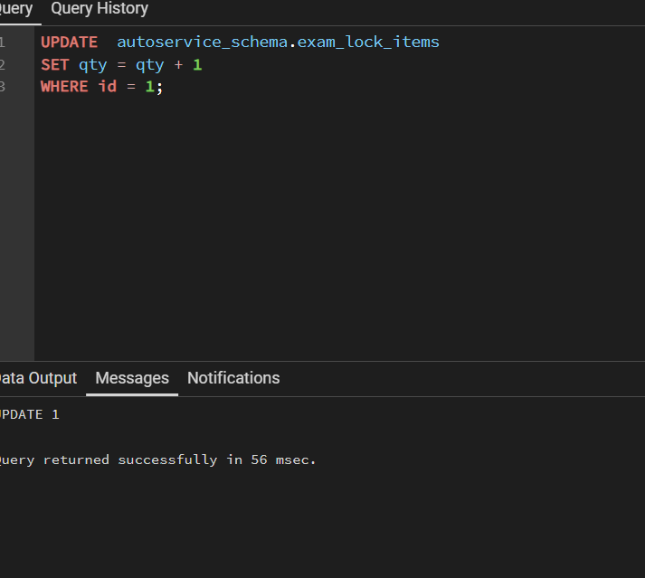

1 задание

1. Постройте план выполнения запроса до изменений.
2. Укажите:
   - какой тип сканирования использован; - -Sequence scan
   - какие из уже созданных индексов не помогают этому запросу; - -Не помогает B tree индекс который навешан на PK
   - почему планировщик выбирает именно такой план. - id не фигурирует в запросе
3. Создайте индекс, который лучше подходит под этот запрос.
   CREATE INDEX dss ON Exams_evant (user_id)
4. Повторно постройте план выполнения.
5. Кратко объясните, что изменилось в плане и почему.
- Теперь используется индекс на user_id
6. Ответьте, нужно ли после создания индекса выполнять ANALYZE, и зачем.
- чтобы планировщик обработал, увидел индекс и строил новые стратегии

2 задание

1. Постройте план выполнения запроса до изменений.
2. Определите, какой тип JOIN использован.
- Hash join
3. Объясните, почему планировщик выбрал именно этот тип JOIN.
- join на равенство, одна таблица на 20000 строк, вторая на 120000
4. Укажите, какие существующие индексы полезны слабо или не полезны для этого запроса.
- hash индекс на country, b tree индекс на created at
5. Предложите и создайте одно улучшение, которое может ускорить запрос.
   Допустимые варианты: новый индекс, другой более подходящий индекс, ANALYZE.
- добавить индексы из пункта 4. Сделать Analyze
6. Повторно постройте план выполнения.
-- а нету времени
7. Кратко поясните, улучшился ли план и за счет чего.
- сто проц улучшится
8. Отдельно укажите, что означает преобладание shared hit или read в BUFFERS.

3 задание

1. Опишите, что изменилось после UPDATE с точки зрения xmin, xmax и ctid.
- xmin увеличился, так как запись была удалена и создана новая. xmax = 0 так как в селекте вилим только неудаленные записи. ctid изменился, так как новая запись в другом месте
2. Объясните, почему в модели MVCC UPDATE не является простым "перезаписыванием" строки.
- 
3. Объясните, что произошло после DELETE и почему строка исчезла из обычного SELECT.
- xmax стал не равен нулю и постгрес не вывел изза этого строку при селекте
4. Кратко сравните:
   - VACUUM;
   - autovacuum;
   - VACUUM FULL.
Vacuum паралельно с работой бд очищает данные, автовакуум - процесс который запускает очистку в фоне. Vacuum Full полностью блочит таблицу и компактно пересобирает данные.
5. Отдельно укажите, какой из этих механизмов может полностью блокировать таблицу.
- Vacuum Full

4 задание

1. Опишите, что происходит с UPDATE в сессии B в первом и во втором эксперименте.
- В первом запросе блокировка  ..... 
2. Объясните, чем FOR SHARE отличается от FOR UPDATE по смыслу и по силе блокировки.
for update экзлюзивная, for share разрешает нескольким транзакциям держать for share на одну строку
3. Укажите, почему обычный SELECT без FOR UPDATE/FOR SHARE ведет себя иначе.
4. Кратко поясните, где в прикладных сценариях имеет смысл использовать FOR UPDATE.