## Gin

~~~sql
-- 1. Поиск по массиву 
EXPLAIN ANALYZE SELECT id FROM autoservice_schema.customer WHERE tags @> ARRAY['VIP'];
CREATE INDEX gin_customer_tags ON autoservice_schema.customer USING GIN (tags);
EXPLAIN ANALYZE SELECT id FROM autoservice_schema.customer WHERE tags @> ARRAY['VIP'];
~~~
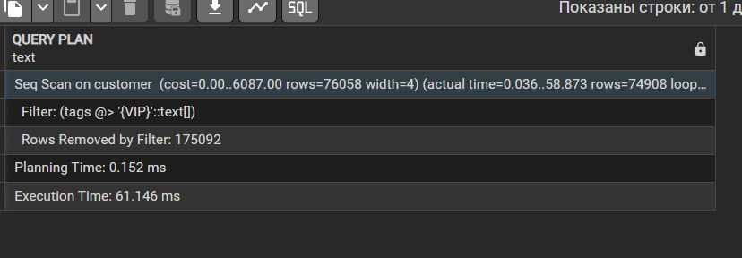

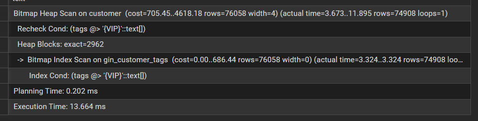

~~~sql
-- 2. Поиск по ключу в JSONB
EXPLAIN ANALYZE SELECT vin FROM autoservice_schema.car WHERE specs @> '{"color": "Red"}';
CREATE INDEX gin_car_specs ON autoservice_schema.car USING GIN (specs);
EXPLAIN ANALYZE SELECT vin FROM autoservice_schema.car WHERE specs @> '{"color": "Red"}';
~~~
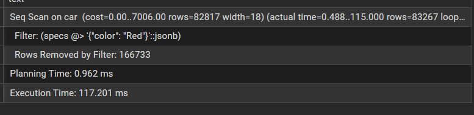

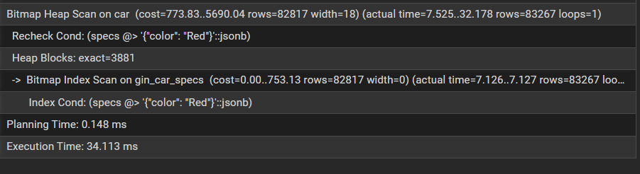

~~~sql
-- 3. Поиск по JSONB
EXPLAIN ANALYZE SELECT id FROM autoservice_schema."order" WHERE meta_info @> '{"priority": 1}';
CREATE INDEX gin_order_meta ON autoservice_schema."order" USING GIN (meta_info jsonb_path_ops);
EXPLAIN ANALYZE SELECT id FROM autoservice_schema."order" WHERE meta_info @> '{"priority": 1}';
~~~

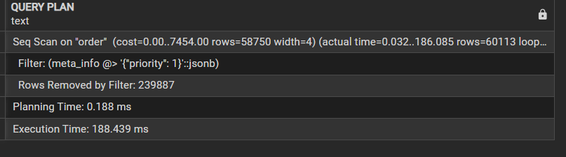

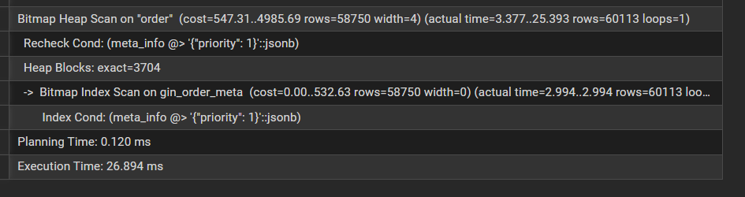

~~~sql
-- 4. Полнотекстовый поиск по tsvector 
EXPLAIN ANALYZE SELECT id FROM autoservice_schema.task WHERE description_search @@ to_tsquery('english', 'fix');
CREATE INDEX gin_task_fts ON autoservice_schema.task USING GIN (description_search);
EXPLAIN ANALYZE SELECT id FROM autoservice_schema.task WHERE description_search @@ to_tsquery('english', 'fix');
~~~

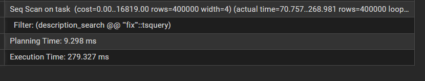

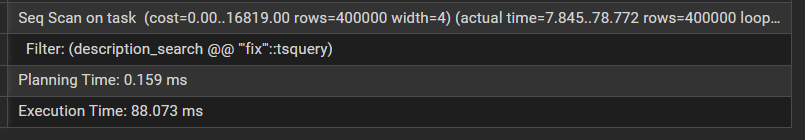

~~~sql
-- 5. Проверка существования ключа в JSONB
EXPLAIN ANALYZE SELECT vin FROM autoservice_schema.car WHERE specs ? 'color';
CREATE INDEX gin_car_specs_keys ON autoservice_schema.car USING GIN (specs jsonb_ops);
EXPLAIN ANALYZE SELECT vin FROM autoservice_schema.car WHERE specs ? 'color';
~~~

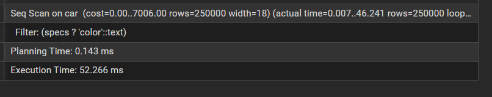

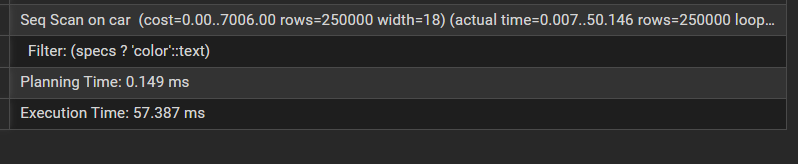

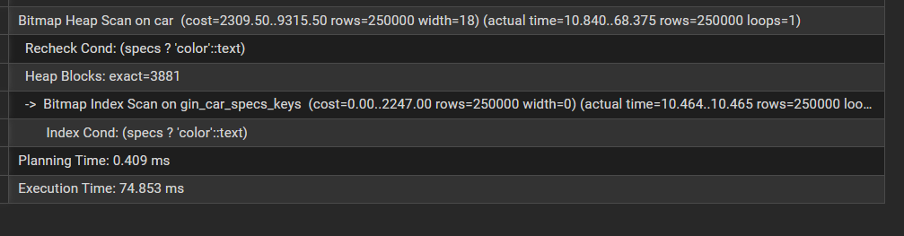

## Gist

~~~sql
-- Поиск по пересечению диапазонов
EXPLAIN ANALYZE SELECT id FROM autoservice_schema.purchase WHERE discount_period && daterange('2026-03-01', '2026-03-31');
CREATE INDEX gist_purch_dates ON autoservice_schema.purchase USING GIST (discount_period);
EXPLAIN ANALYZE SELECT id FROM autoservice_schema.purchase WHERE discount_period && daterange('2026-03-01', '2026-03-31');
~~~

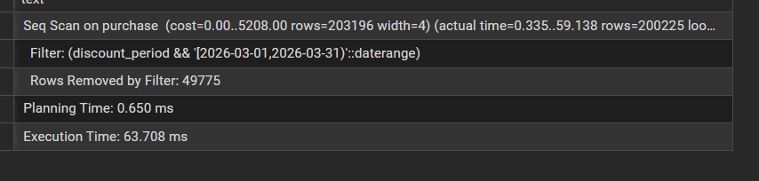

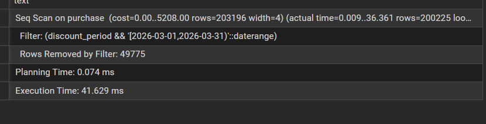

~~~sql
EXPLAIN ANALYZE SELECT id FROM autoservice_schema.purchase WHERE discount_period @> current_date;
CREATE INDEX gist_purch_dates_contain ON autoservice_schema.purchase USING GIST (discount_period);
EXPLAIN ANALYZE SELECT id FROM autoservice_schema.purchase WHERE discount_period @> current_date;
~~~

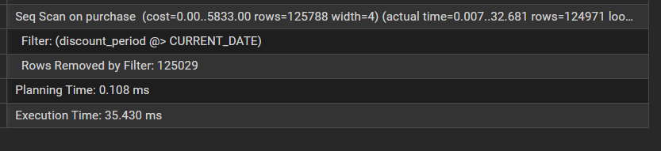

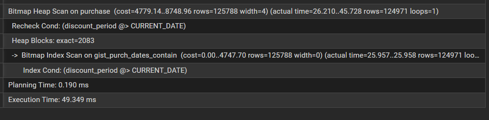

~~~sql
EXPLAIN ANALYZE SELECT id FROM autoservice_schema.customer WHERE full_name LIKE '%Customer 150%';
CREATE INDEX gist_cust_name ON autoservice_schema.customer USING GIST (full_name gist_trgm_ops);
EXPLAIN ANALYZE SELECT id FROM autoservice_schema.customer WHERE full_name LIKE '%Customer 150%';
~~~

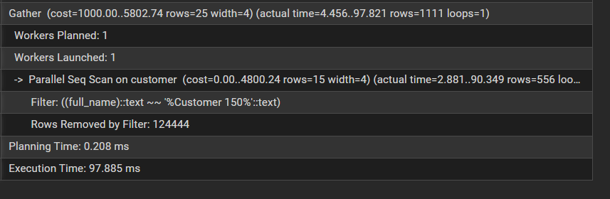

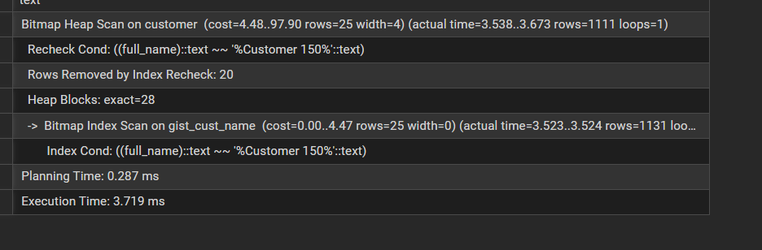

~~~sql
CREATE INDEX gist_task_fts ON autoservice_schema.task USING GIST (description_search);
EXPLAIN ANALYZE SELECT id FROM autoservice_schema.task WHERE description_search @@ to_tsquery('english', 'issue');
~~~

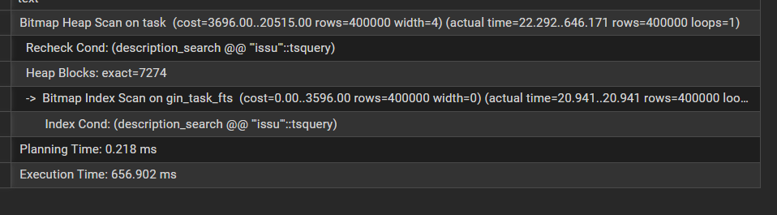

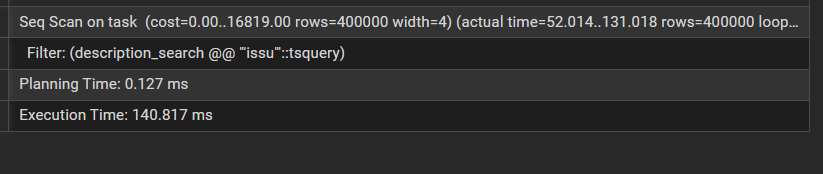

~~~sql
EXPLAIN ANALYZE SELECT id FROM autoservice_schema.task WHERE value BETWEEN 1000 AND 2000;
CREATE INDEX gist_task_val ON autoservice_schema.task USING GIST (value);
EXPLAIN ANALYZE SELECT id FROM autoservice_schema.task WHERE value BETWEEN 1000 AND 2000;
~~~

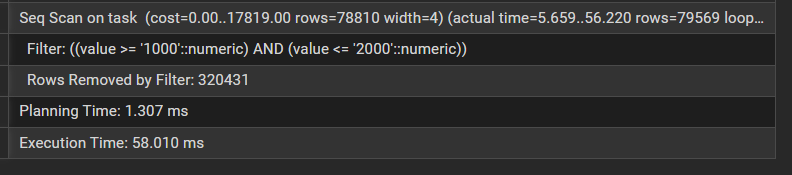

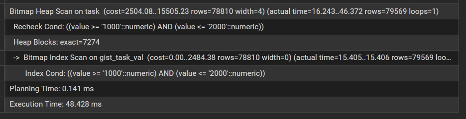

## JOIN

~~~sql
-- 1. Nested Loop
EXPLAIN ANALYZE
SELECT * FROM autoservice_schema.branch_office b
JOIN autoservice_schema.worker w ON b.id = w.id_branch_office;
~~~

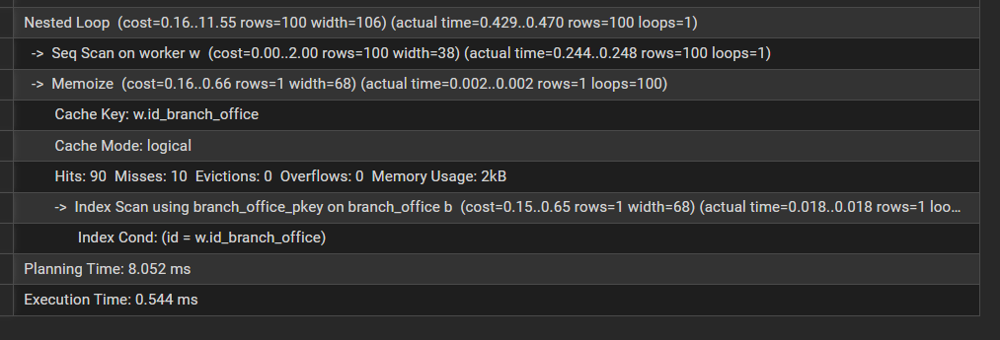

~~~sql
-- 2. Hash Join 
EXPLAIN ANALYZE
SELECT * FROM autoservice_schema.task t
JOIN autoservice_schema.car c ON t.car_id = c.vin;
~~~

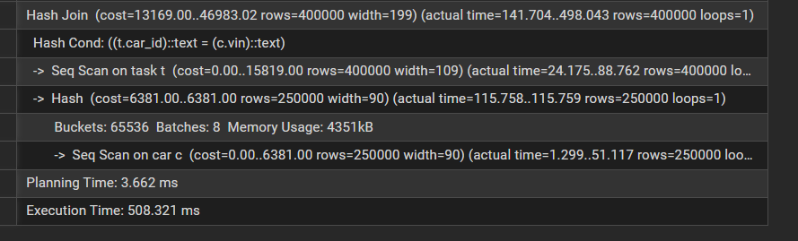

~~~sql
-- 3. Merge Join 
EXPLAIN ANALYZE
SELECT * FROM autoservice_schema.task t
JOIN autoservice_schema."order" o ON t.order_id = o.id
ORDER BY t.order_id;
~~~

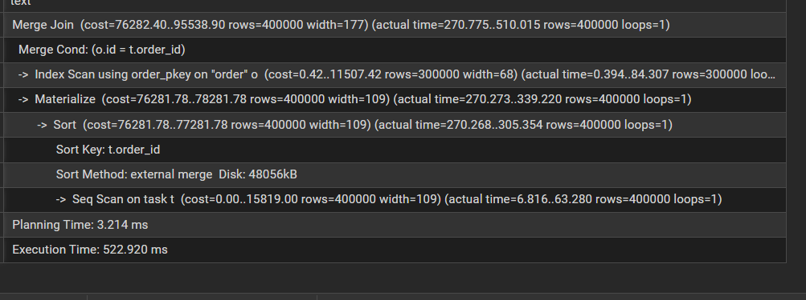

~~~sql
-- 4. LEFT JOIN
EXPLAIN ANALYZE
SELECT o.id, c.closure_date
FROM autoservice_schema."order" o
LEFT JOIN autoservice_schema.order_closure_date c ON o.id = c.order_id;
~~~

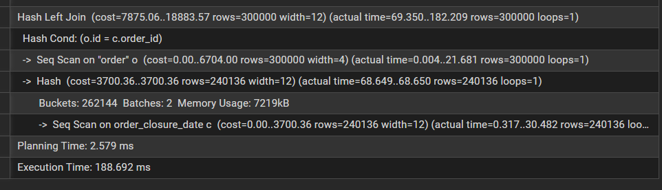

~~~sql
-- 5. Множественный JOIN 
EXPLAIN ANALYZE
SELECT c.full_name, t.description
FROM autoservice_schema.customer c
JOIN autoservice_schema."order" o ON c.id = o.customer_id
JOIN autoservice_schema.task t ON o.id = t.order_id
LIMIT 100;
~~~

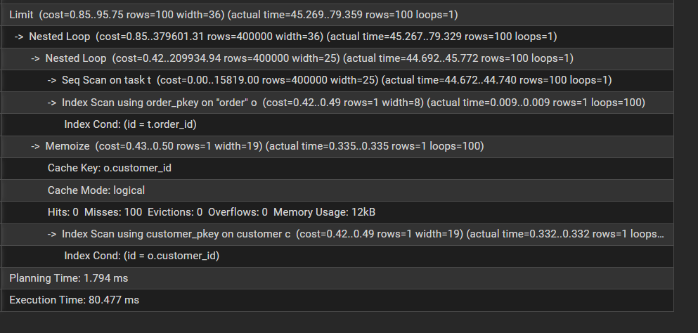

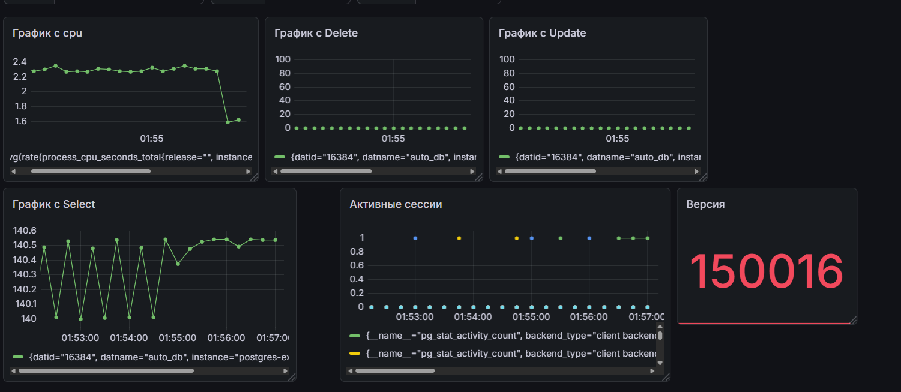