## xmin, xmax, ctid при UPDATE

```sql
INSERT INTO autoservice_schema."order" (customer_id, creation_date, description)
VALUES (1, NOW(), 'тестовый заказ для MVCC');

SELECT id, xmin, xmax, ctid
FROM autoservice_schema."order"
ORDER BY id DESC LIMIT 1;

UPDATE autoservice_schema."order"
SET description = 'обновлённый заказ'
WHERE id = (SELECT MAX(id) FROM autoservice_schema."order");

SELECT id, xmin, xmax, ctid
FROM autoservice_schema."order"
ORDER BY id DESC LIMIT 1;
```

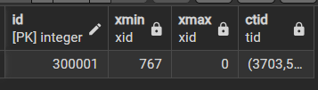

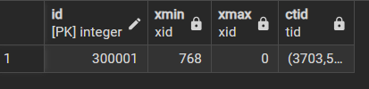

## t-infotask

```sql
SELECT lp, t_xmin, t_xmax, t_ctid,
       t_infomask::bit(16)  AS infomask_bits,
       t_infomask
FROM heap_page_items(get_raw_page('autoservice_schema."order"', 0));
```
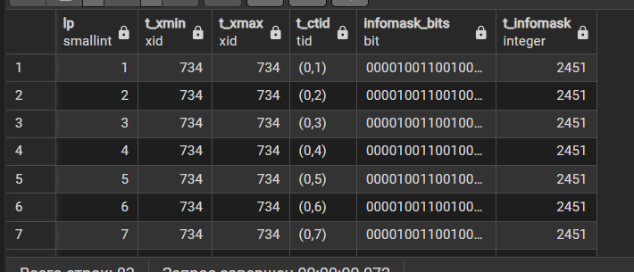

## Обновление в рахных транзакциях

### 1 окно
```sql
BEGIN;

UPDATE autoservice_schema."order"
SET description = 'блокировка из транзакции 1'
WHERE id = (SELECT MAX(id) FROM autoservice_schema."order");
SELECT txid_current();
------
COMMIT;
```

### 2 окно
```sql
SELECT id, xmin, xmax, ctid
FROM autoservice_schema."order"
ORDER BY id DESC LIMIT 1;
```

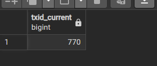

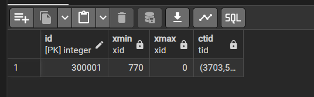


## dedlock
1
```sql
BEGIN;
UPDATE autoservice_schema."order" SET description = 'lock A' WHERE id = 1;
```

2
```sql
BEGIN;
UPDATE autoservice_schema."order" SET description = 'lock B' WHERE id = 2;

UPDATE autoservice_schema."order" SET description = 'lock B->1' WHERE id = 1;
```

1
```sql
UPDATE autoservice_schema."order" SET description = 'lock A->2' WHERE id = 2;
```

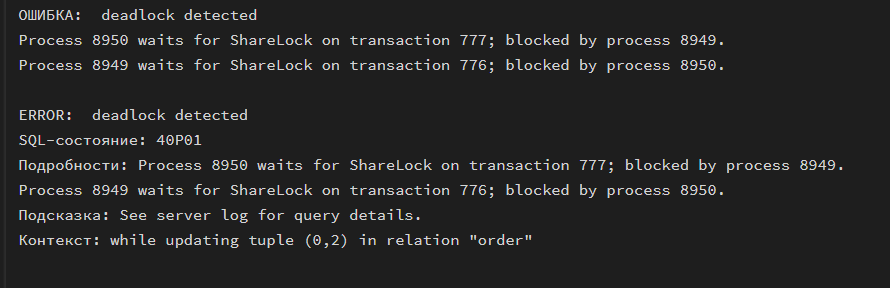

## 5 блокировки

### for update
1
```sql
BEGIN;
SELECT * FROM autoservice_schema."order" WHERE id = 1 FOR UPDATE;
```

2
```sql
BEGIN;
SELECT * FROM autoservice_schema."order" WHERE id = 1 FOR UPDATE;
```

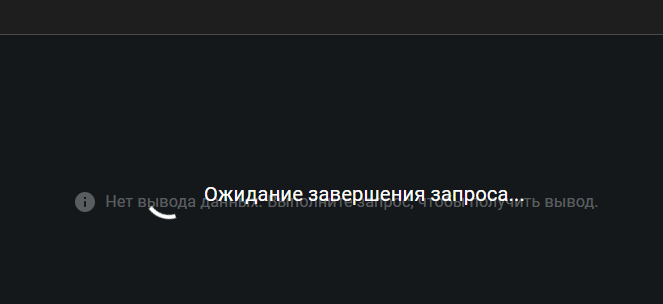

### for sharing

1
```sql
BEGIN;
SELECT * FROM autoservice_schema."order" WHERE id = 1 FOR SHARE;
```

2
```sql
BEGIN;
SELECT * FROM autoservice_schema."order" WHERE id = 1 FOR SHARE;
```

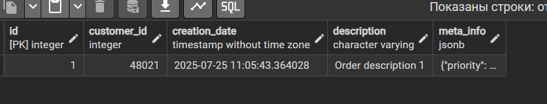


## очистка данных

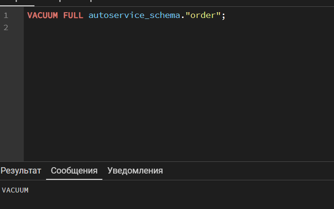

```sql
SELECT relname, n_live_tup, n_dead_tup
FROM pg_stat_user_tables
WHERE schemaname = 'autoservice_schema';

```

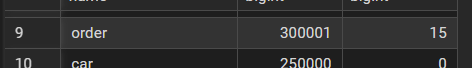

```sql
VACUUM ANALYZE autoservice_schema."order";
SELECT relname, n_live_tup, n_dead_tup, last_vacuum
FROM pg_stat_user_tables
WHERE schemaname = 'autoservice_schema';
```

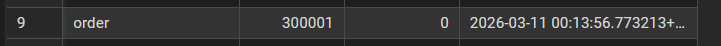