## 1. Сравнение LSN до и после INSERT

```sql
-- LSN до вставки
SELECT pg_current_wal_lsn() AS lsn_before_insert;

INSERT INTO autoservice_schema.customer (full_name, phone_number) 
VALUES ('Test User', '777-888');

-- LSN после вставки
SELECT pg_current_wal_lsn() AS lsn_after_insert;

SELECT pg_wal_lsn_diff('0/5EEAAF0'::pg_lsn, '0/5EEA030'::pg_lsn) AS zz_;
```

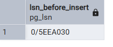

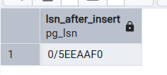

Разница
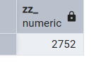

## 2. Сравнение WAL до и после commit

```sql
BEGIN;
SELECT pg_current_wal_lsn() AS lsn_start_transaction;

UPDATE autoservice_schema.customer 
SET phone_number = '000-000' 
WHERE full_name = 'Test User';

SELECT pg_current_wal_lsn() AS lsn_after_update_in_transaction;

COMMIT;

SELECT pg_current_wal_lsn() AS lsn_after_commit;
```

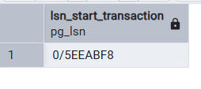

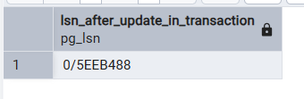

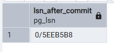

Разница 112 и 48 байт соответственно

## 3. Анализ WAL размера после массовой операции

```sql
-- LSN перед массовой операцией
SELECT pg_current_wal_lsn() AS lsn_before_mass_operation;

INSERT INTO autoservice_schema.customer (full_name, phone_number)
SELECT 'Mass User ' || i, 'phone-' || i
FROM generate_series(1, 10000) s(i);

SELECT pg_current_wal_lsn() AS lsn_after_mass_operation;
```

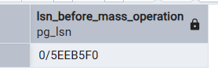

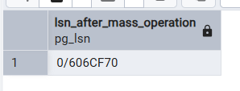

Разница 1579392

## 4. Dump только структуры базы

```bash
pg_dump -h localhost -U postgres -s -d semestrovkaBD --encoding=UTF8 -f  db_zdump.sql

psql -h localhost -U postgres -d Zz -f db_zdump.sql
```

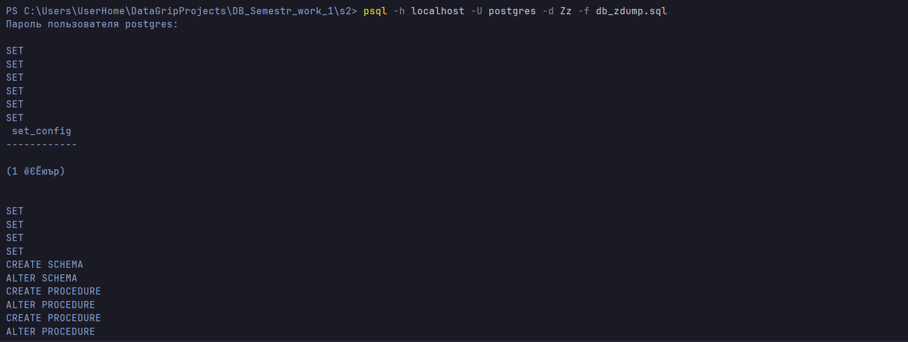

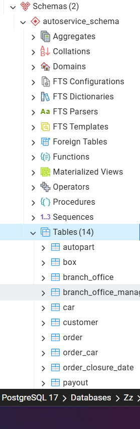

## 5. Dump одной таблицы

```bash
pg_dump -h localhost -U postgres -t 'autoservice_schema.customer' -d semestrovkaBD --encoding=UTF8 -f  customer_table_dump.sql

psql -h localhost -U postgres -d Zz -f customer_table_dump.sql
```

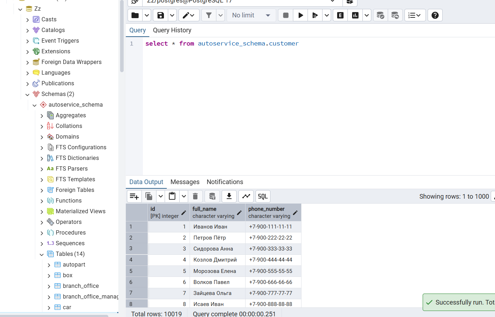

## 6. Создание Seed

```sql
INSERT INTO autoservice_schema.branch_office (address, phone_number)
VALUES 
    ('Москва, ул. Пушкина, 10', '8-800-555-35-35'),
    ('Санкт-Петербург, пр. Ленина, 25', '8-812-100-20-30'),
    ('Казань, ул. Татарстан, 5', '8-843-300-40-50');

INSERT INTO autoservice_schema.customer (full_name, phone_number)
VALUES 
    ('Иван Иванов', '79001112233'),
    ('Петр Петров', '79004445566'),
    ('Анна Сидорова', '79007778899');
```

## 7. Проверка идемпотентности Seed (ON CONFLICT)

```sql
-- Идемпотентная вставка - если есть, не добавляем
INSERT INTO autoservice_schema.branch_office (id, address, phone_number)
VALUES (100, 'Новосибирск, ул. Красная, 1', '8-383-000-00-00')
ON CONFLICT (id) DO NOTHING;

-- Идемпотентная вставка с обновлением - если существует, то обновим. Идемпотетность - пр повторном вызове не будет ошибки
INSERT INTO autoservice_schema.customer (id, full_name, phone_number)
VALUES (1, 'Иван Иванов (Обновленный)', '79999999999')
ON CONFLICT (id) 
DO UPDATE SET 
    full_name = EXCLUDED.full_name,
    phone_number = EXCLUDED.phone_number;
```

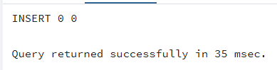

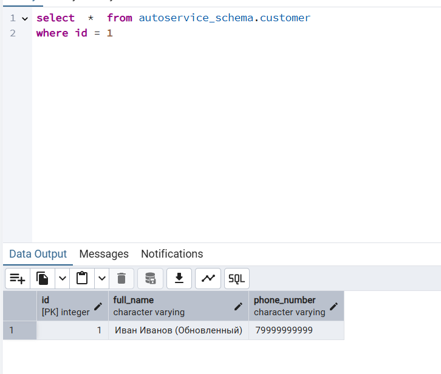