## 1. Развертывание 3 PostgreSQL instance

### а) Настройка Master
```sql
CREATE USER replication_user WITH REPLICATION PASSWORD '1234';

SELECT * FROM pg_create_physical_replication_slot('replica_1_slot');
SELECT * FROM pg_create_physical_replication_slot('replica_2_slot');
```

```bash
echo "host replication replication_user 0.0.0.0/0 md5" >> "$PGDATA/pg_hba.conf"
```

Проверка статуса репликации

```bash
docker exec -it pg_master psql -U postgres -c "SELECT * FROM pg_stat_replication;"
```

```bash
docker exec -it pg_replica_1 psql -U postgres -c "SELECT pg_is_in_recovery();"

docker exec -it pg_replica_2 psql -U postgres -c "SELECT pg_is_in_recovery();"
```

```bash
docker exec -it pg_master psql -U postgres -c "SELECT slot_name, active, restart_lsn FROM pg_replication_slots;"
```

## 2. Проверка репликации данных

### а) Вставить данные на master

```sql
INSERT INTO autoservice_schema.customer (full_name, phone_number) 
VALUES ('Replication Master User', '8-999-000-11-22');
```

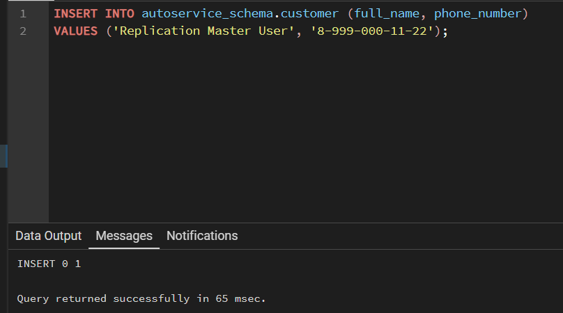


### b) Проверить наличие строки на репликах

```bash
docker exec -it pg_replica_1 psql -U postgres -d auto_db -c "SELECT * FROM autoservice_schema.customer WHERE full_name = 'Replication Master User';"
```
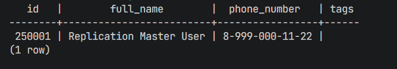


```bash
docker exec -it pg_replica_2 psql -U postgres -d auto_db -c "SELECT * FROM autoservice_schema.customer WHERE full_name = 'Replication Master User';"
```
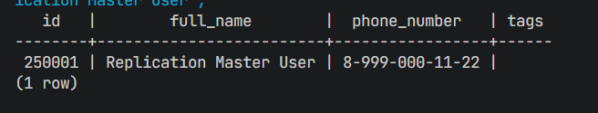

### c) Что произойдет если попробовать вставить данные на реплике

Попробуем выполнить команду `INSERT` напрямую на одной из реплик через консоль:

```bash
docker exec -it pg_replica_1 psql -U postgres -d auto_db -c "INSERT INTO autoservice_schema.customer (full_name, phone_number) VALUES ('Replica Direct User', '0-000-000-00-00');"
```

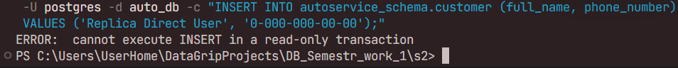

## 3. Анализ replication lag

### а) Создать нагрузку INSERT

```sql
INSERT INTO autoservice_schema.customer (full_name, phone_number)
SELECT 'Lag Test User ' || i, 'phone-' || i
FROM generate_series(1, 100000) s(i);
```

### b) Наблюдать lag

Во время выполнения вставки или сразу после неё, проверим задержку репликации на мастере. Мы можем увидеть разницу в байтах между тем, что записано на мастере, и тем, что уже получили и применили реплики.

**Запрос для мониторинга лага на мастере:**

```bash
docker exec -it pg_master psql -U postgres -c "
SELECT 
    application_name, 
    client_addr, 
    state, 
    pg_wal_lsn_diff(pg_current_wal_lsn(), sent_lsn) AS sent_lag,
    pg_wal_lsn_diff(pg_current_wal_lsn(), write_lsn) AS write_lag,
    pg_wal_lsn_diff(pg_current_wal_lsn(), flush_lsn) AS flush_lag,
    pg_wal_lsn_diff(pg_current_wal_lsn(), replay_lsn) AS replay_lag
FROM pg_stat_replication;"
```

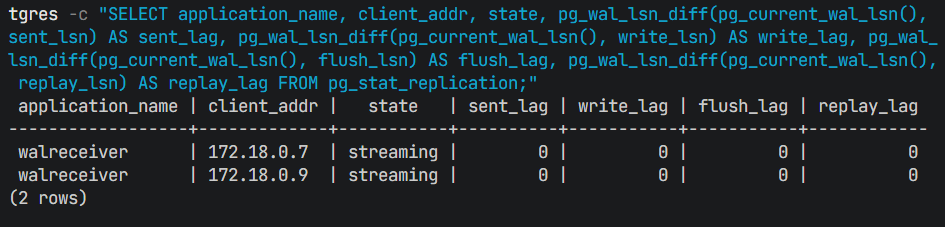

- `sent_lag`: данные отправлены мастером, но еще не получены репликой.
- `write_lag`: данные получены репликой и записаны в ОС, но еще не на диск.
- `flush_lag`: данные записаны на диск реплики.
- `replay_lag`: данные применены в базу данных на реплике (самый важный показатель для чтения).

## 4. Логическая репликация

###  Подготовка Master

лежит в миграциях

```sql
CREATE PUBLICATION my_publication FOR TABLE autoservice_schema.customer;

GRANT USAGE ON SCHEMA autoservice_schema TO replication_user;
GRANT SELECT ON ALL TABLES IN SCHEMA autoservice_schema TO replication_user;
```


###  Подготовка Подписчика (pg_logical_replica)

копирование структуру с мастера на логическую реплику

```bash
docker exec pg_master pg_dump -U postgres -s -d auto_db | docker exec -i pg_logical_replica psql -U postgres -d auto_db
```

создаем подписку

```bash
docker exec -it pg_logical_replica psql -U postgres -d auto_db -c "CREATE SUBSCRIPTION my_subscription CONNECTION 'host=pg_master port=5432 dbname=auto_db user=replication_user password=1234' PUBLICATION my_publication;"
```

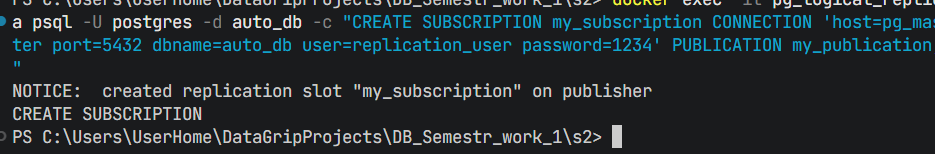


###  Проверка репликации данных

Вставим данные на мастере:

```sql
INSERT INTO autoservice_schema.customer (full_name, phone_number) 
VALUES ('Logical Test User', '111-222');
```

Проверим наличие на логической реплике:

```bash
docker exec -it pg_logical_replica psql -U postgres -d auto_db -c "SELECT * FROM autoservice_schema.customer WHERE full_name = 'Logical Test User';"
```

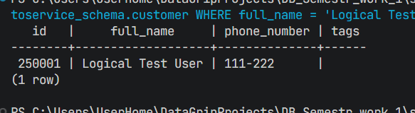

###  Проверка отсутствия репликации DDL


```sql
ALTER TABLE autoservice_schema.customer ADD COLUMN middle_name VARCHAR(255);
```

```bash
docker exec -it pg_logical_replica psql -U postgres -d auto_db -c "\d autoservice_schema.customer"
```

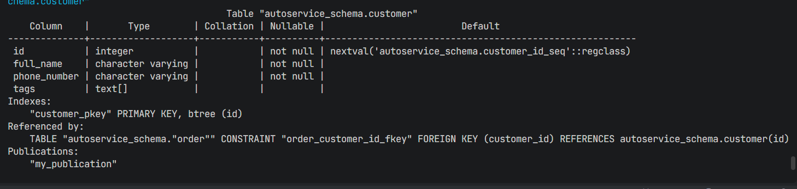

###  Проверка REPLICA IDENTITY (Таблица без PK)

```sql
CREATE TABLE autoservice_schema.test_no_pk (id INT, name TEXT);
ALTER PUBLICATION my_publication ADD TABLE autoservice_schema.test_no_pk;
```

```bash
docker exec -it pg_logical_replica psql -U postgres -d auto_db -c "CREATE TABLE autoservice_schema.test_no_pk (id INT, name TEXT);"
```

```sql
INSERT INTO autoservice_schema.test_no_pk VALUES (1, 'initial');
UPDATE autoservice_schema.test_no_pk SET name = 'updated' WHERE id = 1;
```
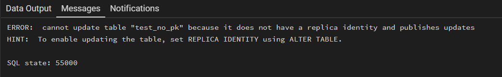

###  Проверка replication status

```bash
SELECT * FROM pg_stat_replication;
SELECT * FROM pg_replication_slots WHERE slot_type = 'logical';
```

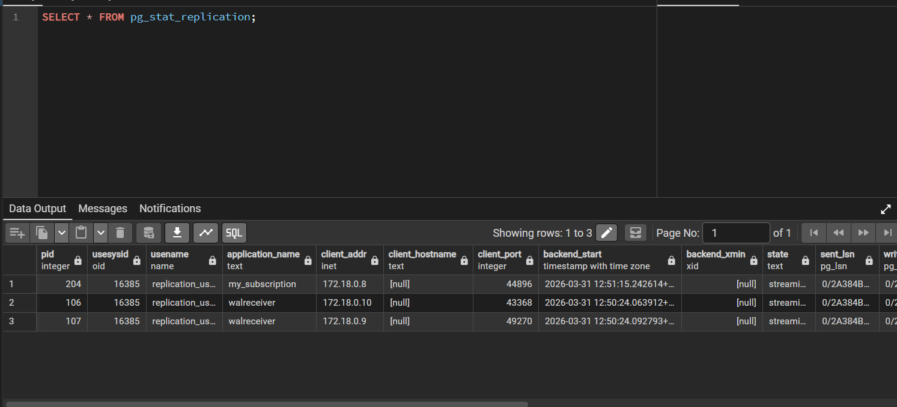
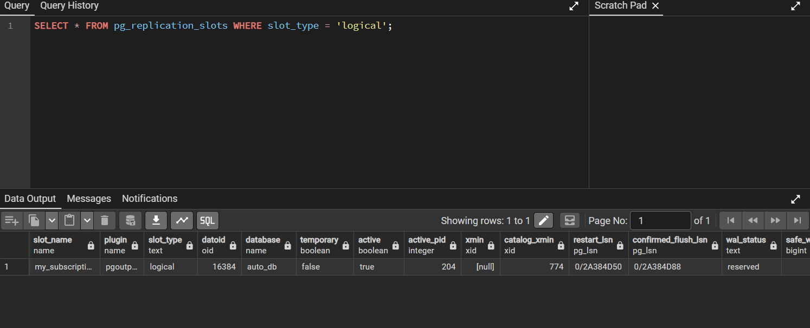


```bash
docker exec -it pg_logical_replica psql -U postgres -d auto_db -c "SELECT * FROM pg_stat_subscription;"
```

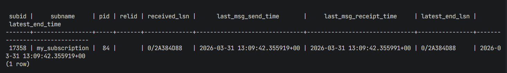

### Проверка replication status

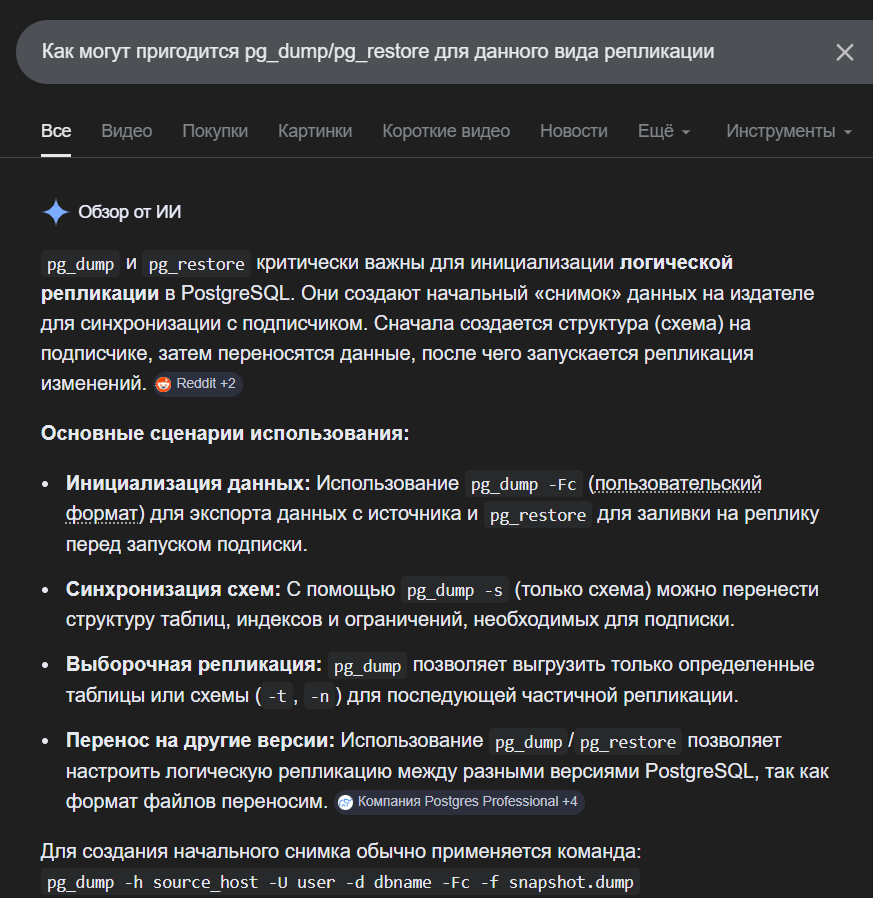