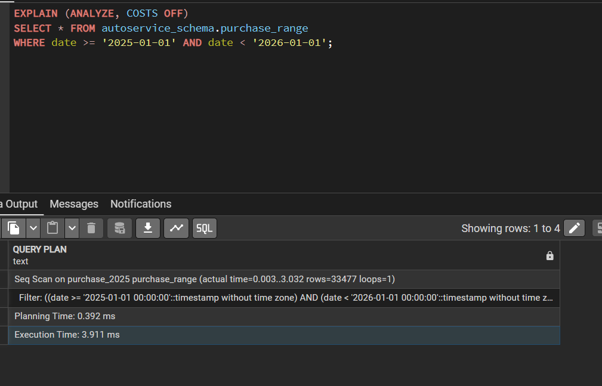
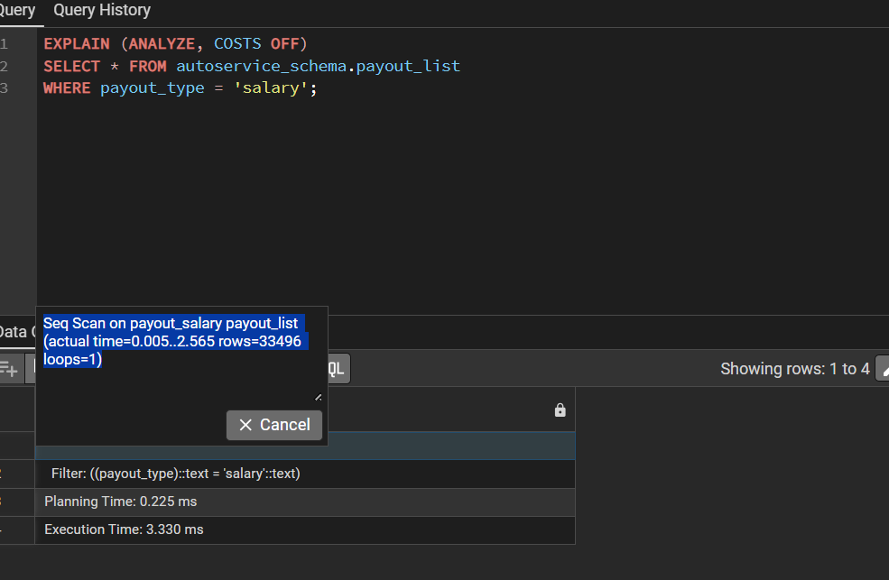
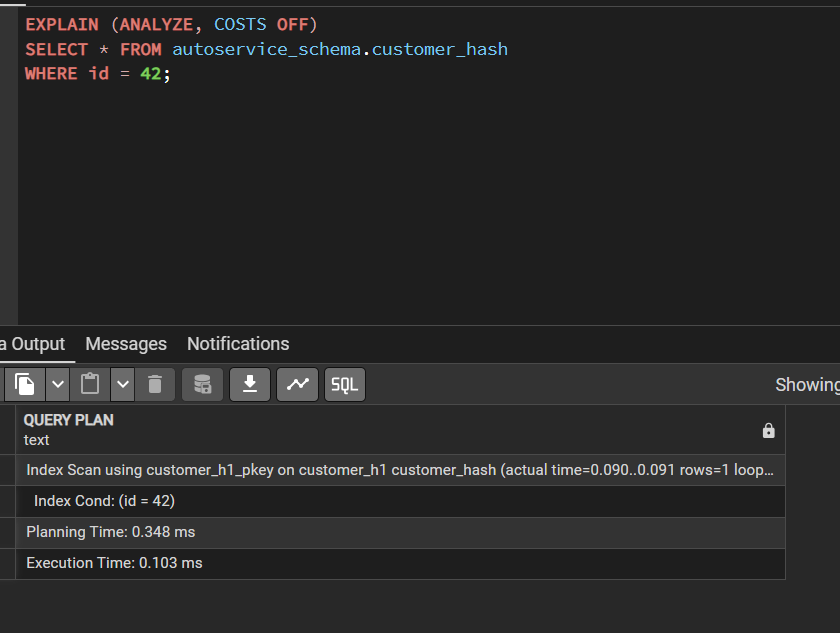
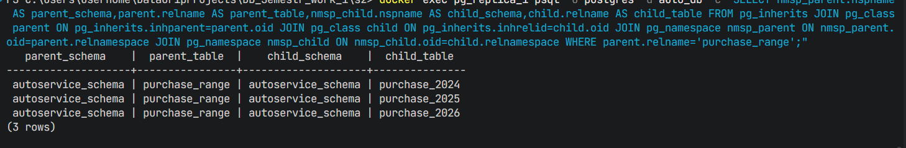
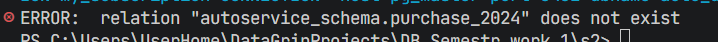
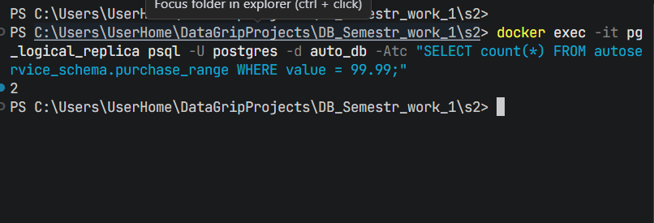
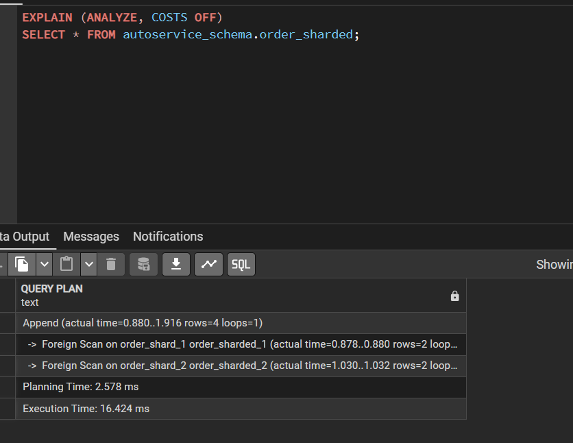
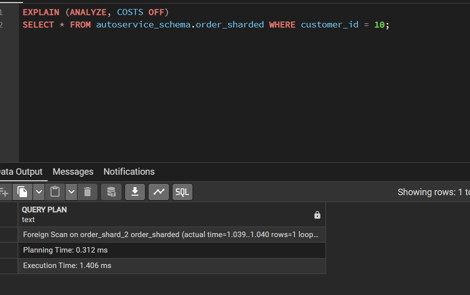

## 1. Секционирование (Partitioning)

### а) RANGE Partitioning (Секционирование по диапазону)

**Запрос для анализа:**
```sql
EXPLAIN (ANALYZE, COSTS OFF)
SELECT * FROM autoservice_schema.purchase_range 
WHERE date >= '2025-01-01' AND date < '2026-01-01';
```




### б) LIST Partitioning (Секционирование по списку)

**Запрос для анализа:**
```sql
EXPLAIN (ANALYZE, COSTS OFF)
SELECT * FROM autoservice_schema.payout_list 
WHERE payout_type = 'salary';
```




### в) HASH Partitioning (Секционирование по хешу)

**Запрос для анализа:**
```sql
EXPLAIN (ANALYZE, COSTS OFF)
SELECT * FROM autoservice_schema.customer_hash 
WHERE id = 42;
```




## 2. Секционирование и физическая репликация

### а) Проверить что секционирование есть на репликах

```bash
docker exec -it pg_replica_1 psql -U postgres -d auto_db -c "
SELECT 
    nmsp_parent.nspname AS parent_schema,
    parent.relname      AS parent_table,
    nmsp_child.nspname  AS child_schema,
    child.relname       AS child_table
FROM pg_inherits
    JOIN pg_class parent            ON pg_inherits.inhparent = parent.oid
    JOIN pg_class child             ON pg_inherits.inhrelid  = child.oid
    JOIN pg_namespace nmsp_parent   ON nmsp_parent.oid       = parent.relnamespace
    JOIN pg_namespace nmsp_child    ON nmsp_child.oid        = child.relnamespace
WHERE parent.relname = 'purchase_range';"
```




---

## 3. Логическая репликация и секционирование

### а) publish_via_partition_root = off 

```sql
ALTER PUBLICATION my_publication ADD TABLE autoservice_schema.purchase_range;
ALTER PUBLICATION my_publication SET (publish_via_partition_root = false);
```

```bash
docker exec -it pg_logical_replica psql -U postgres -d auto_db -c "
CREATE TABLE autoservice_schema.purchase_range (
    id SERIAL,
    provider_id INT,
    date TIMESTAMP WITHOUT TIME ZONE NOT NULL,
    value DECIMAL(100, 2),
    PRIMARY KEY (id, date)
);"
```

```sql
INSERT INTO autoservice_schema.purchase_range (date, value) VALUES ('2025-05-10', 999.00);
```

```bash
docker logs pg_logical_replica --tail 20
```


---

### б) Вариант 2: publish_via_partition_root = on

```sql
ALTER PUBLICATION my_publication SET (publish_via_partition_root = true);
```

```sql
INSERT INTO autoservice_schema.purchase_range (date, value) VALUES ('2025-06-15', 777.00);
```


```bash
docker exec -it pg_logical_replica psql -U postgres -d auto_db -c "SELECT * FROM autoservice_schema.purchase_range WHERE value = 777.00;"
```



---

## 4. Шардирование через postgres_fdw

### а) Реализация шардирования

в миграциях

### c) Простой запрос на все данные

```sql
EXPLAIN (ANALYZE, COSTS OFF)
SELECT * FROM autoservice_schema.order_sharded;
```



### d) Простой запрос на шард

```sql
EXPLAIN (ANALYZE, COSTS OFF)
SELECT * FROM autoservice_schema.order_sharded WHERE customer_id = 10;
```




