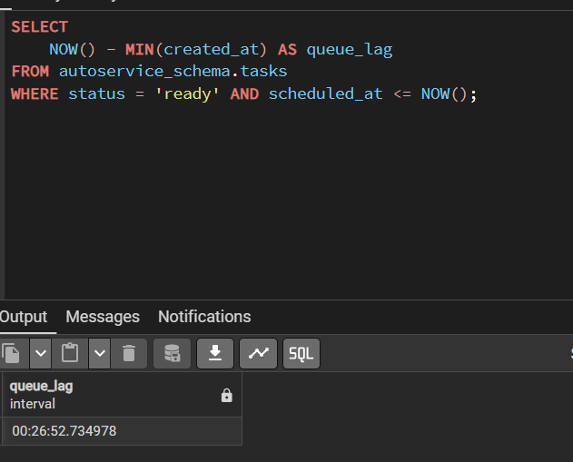
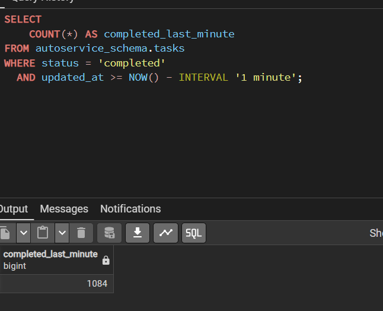
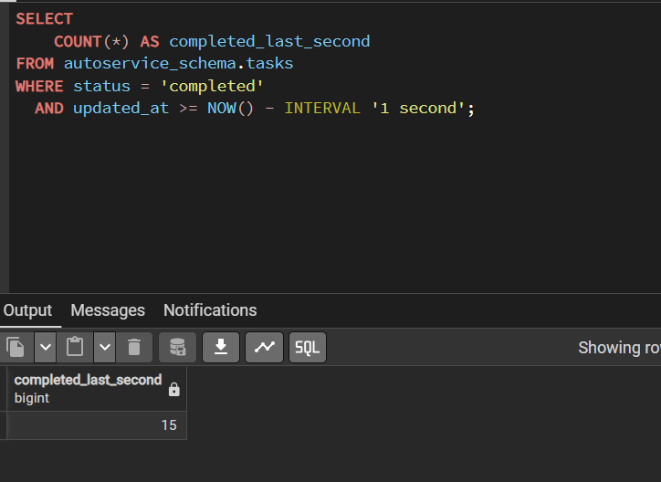
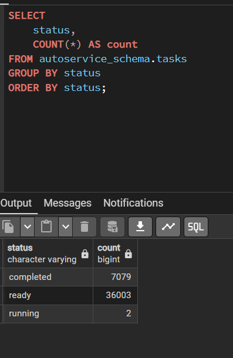
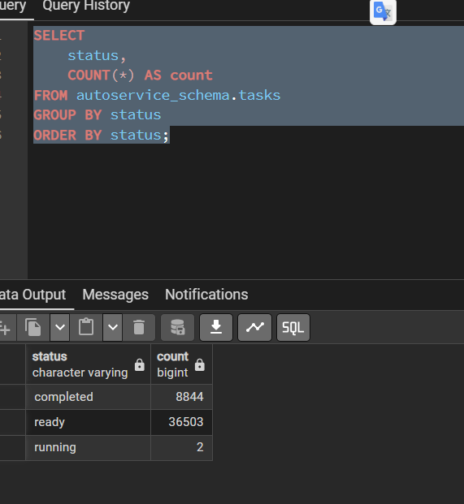
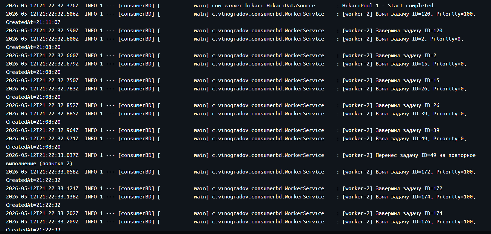

# Отчет по домашнему заданию: Очередь задач

## SQL-запросы для мониторинга

### 1. Лаг очереди
```sql
SELECT 
    NOW() - MIN(created_at) AS queue_lag
FROM autoservice_schema.tasks
WHERE status = 'ready' AND scheduled_at <= NOW();
```



### 2. Пропускная способность (за последнюю минуту)
```sql
SELECT 
    COUNT(*) AS completed_last_minute
FROM autoservice_schema.tasks
WHERE status = 'completed'
  AND updated_at >= NOW() - INTERVAL '1 minute';
```



### 3. Пропускная способность (за последнюю секунду)
```sql
SELECT 
    COUNT(*) AS completed_last_second
FROM autoservice_schema.tasks
WHERE status = 'completed'
  AND updated_at >= NOW() - INTERVAL '1 second';
```



### 4. Общий статус очереди
```sql
SELECT 
    status,
    COUNT(*) AS count
FROM autoservice_schema.tasks
GROUP BY status
ORDER BY status;
```





## Результаты тестирования

Берем больше по приоритету, даже если они позже созданы

